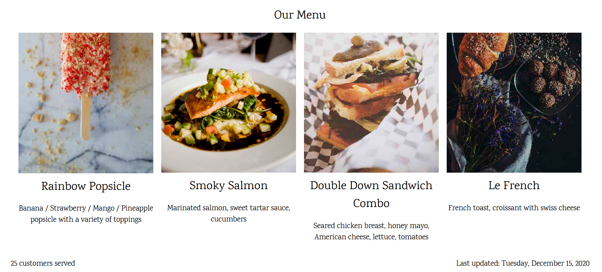
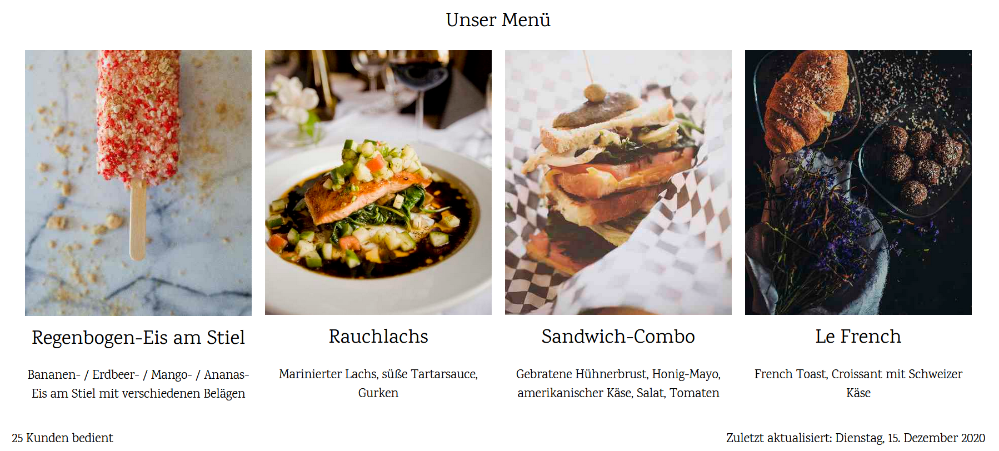

# CherryPy i18n with Babel and Jinja2
Learn how to make the most of CherryPy and build a multilingual web application. Leveraging the power of Babel and Jinja2 as the perfect recipe for internationalization and localization in Python.

# Setup
For your information, this tutorial is based on Python3. Highly recommended to create a virtual environment before the installation

Run the following command in your terminal.

    pip install cherrypy

    pip install babel

    pip install jinja2

# Language Files
Language files is based on simple JSON data format.

```js
{
  "food_title_01": "Sandwich Breakfast: A Real NYC Classic",
  "food_description_01": "Slice ham, cheese, lettuce, tomatoes, pickles",
  "food_title_02": "Megatron Steak",
  "food_description_02": "Grilled Filet Mignon, roasted peppers, grilled asparagus, crispy onions",
  "food_title_03": "Juicy Cherries",
  "food_description_03": "Mixed greens, creamy herb dressing",
  "food_title_04": "Robust Wine and Vegetable Pasta",
  "food_description_04": "Mozzarella cheese , broccolli, red wine tossed with penne pasta",
  "food_title_05": "Rainbow Popsicle",
  "food_description_05": "Banana / Strawberry / Mango / Pineapple popsicle with a variety of toppings",
  "food_title_06": "Smoky Salmon",
  "food_description_06": "Marinated salmon, sweet tartar sauce, cucumbers",
  "food_title_07": "Double Down Sandwich Combo",
  "food_description_07": "Seared chicken breast, honey mayo, American cheese, lettuce, tomatoes",
  "food_title_08": "Le French",
  "food_description_08": "French toast, croissant with swiss cheese",
  "menu": "Our Menu",
  "customer": "customer",
  "customer_plural": "customers",
  "serve": "served",
  "last_updated_text": "Last updated"
}
```

# index.html
This tutorial uses the lite version of [food blog HTML template made by W3.CSS](https://www.w3schools.com/w3css/tryw3css_templates_food_blog.htm)

# myapp.py
Complete code for CherryPy server

```python
import cherrypy
import os
import glob
import json
import datetime
from jinja2 import Environment, FileSystemLoader
from babel.dates import format_date, format_datetime, get_timezone
from babel.numbers import format_number
from babel.plural import PluralRule

# initialization
env = Environment(loader=FileSystemLoader('templates'))

app_language = 'en_US'
languages = {}
tz = get_timezone('Asia/Singapore')
plural_rule = PluralRule({'one': 'n in 0..1'})

# dynamic loading of language files using glob
language_list = glob.glob("languages/*.json")
for lang in language_list:
    filename = lang.split('\\')
    lang_code = filename[1].split('.')[0]

    with open(lang, 'r', encoding='utf8') as file:
        languages[lang_code] = json.load(file)


# functions for custom filters
def plural_formatting(key_value, input, lang):
    key = ''
    for i in languages[lang]:
        if(key_value == languages[lang][i]):
            key = i
            break

    if not key:
        return key_value

    plural_key = f"{key}_plural"

    if(plural_rule(input) != 'one' and plural_key in languages[lang]):
        key = plural_key

    return languages[lang][key]


def number_formatting(input, lang):
    return format_number(input, locale=lang)


def date_formatting(input, lang):
    # format_datetime(datetime.datetime.now(), tzinfo=tz, format='full', locale=lang)
    return format_date(input, format='full', locale=lang)


# assigning the corresponding function to Jinja2 filters
env.filters['plural_formatting'] = plural_formatting
env.filters['number_formatting'] = number_formatting
env.filters['date_formatting'] = date_formatting


# main class
class FoodBlog(object):
    @cherrypy.expose
    def index(self):
        return "Hello world!"

    @cherrypy.expose(['über_uns', '关于我们'])  # set aliases
    def about_us(self, lang=app_language):
        if(lang not in languages):
            lang = app_language

        template = env.get_template('index.html')
        return template.render(**languages[lang], locale=lang, last_updated_value=datetime.datetime.now(), customer_value=25)


if __name__ == '__main__':
    # configurations
    conf = {
        '/static': {
            'tools.staticdir.on': True,
            'tools.staticdir.dir': os.path.abspath(os.path.join(os.path.dirname(__file__), 'static'))
        }
    }
    cherrypy.quickstart(FoodBlog(), '/', conf)
```

# Running CherryPy

    python myapp.py

# Loading the web app in your browser
Webpage for English (default)

    http://localhost:8080/about-us

    http://localhost:8080/about-us?lang=en_US



For German internationalization, go to the following url

    http://localhost:8080/about-us?lang=de_DE



# Localized Routing
CherryPy has support for setting aliases via expose decorator, the following URLs lead to the same webpage.

    http://localhost:8080/about-us

    http://localhost:8080/über_uns

    http://localhost:8080/关于我们
